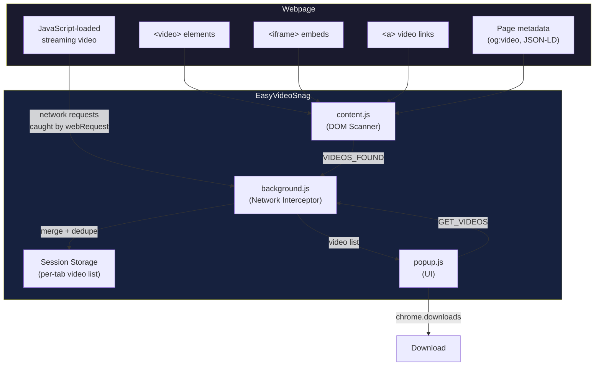
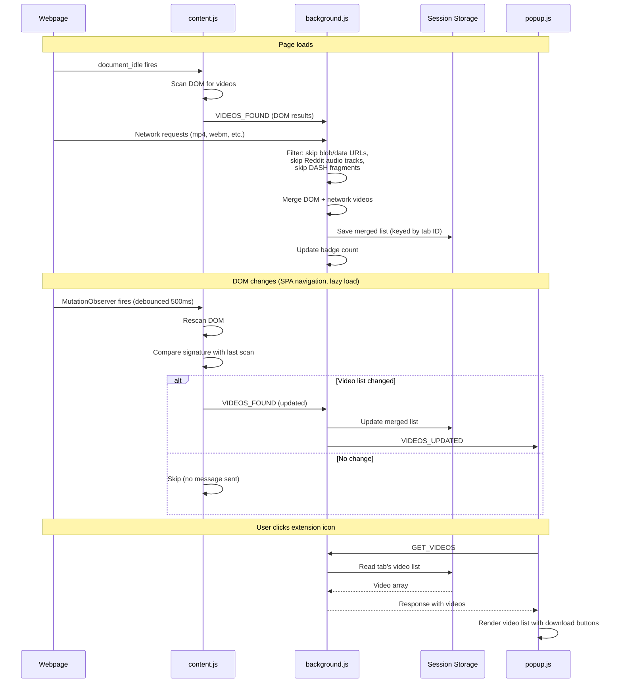
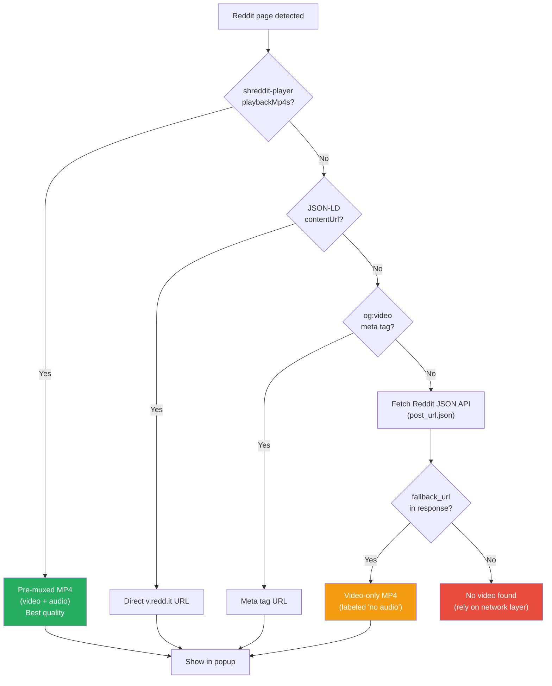
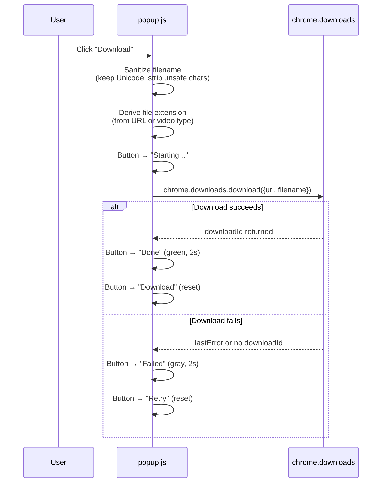
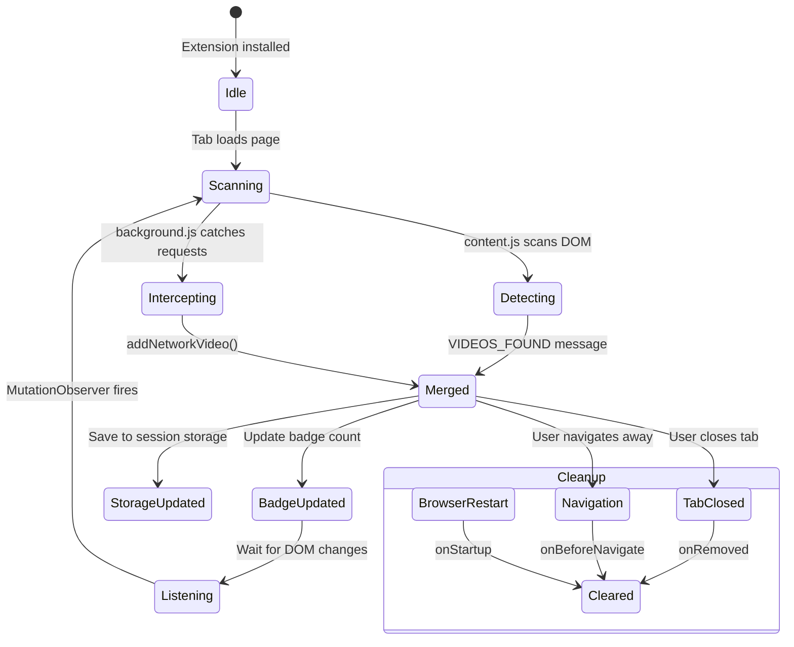

# EasyVideoSnag

A Chrome extension that detects and downloads videos from any webpage. Two detection layers work together: DOM scanning finds visible video elements, network interception catches videos loaded behind the scenes by JavaScript streaming APIs.

Works on Reddit, Twitter/X, Vimeo, Dailymotion, and any site with standard HTML5 video.

---

## How It Works



### Two Detection Layers

**Layer 1: DOM Scanning** (`content.js`)

Runs on every page. Scans the DOM for video sources:

| What it finds | How |
|---|---|
| HTML5 videos | `<video src>` and `<source>` children |
| Embedded videos | `<iframe>` pointing to YouTube, Vimeo, Dailymotion, Twitch, Streamable, Facebook, TikTok |
| Direct links | `<a href>` to `.mp4`, `.webm`, `.ogg`, `.mov`, `.avi`, `.mkv`, `.m3u8`, `.mpd` |
| Data attributes | `data-src`, `data-video-src` on `<video>` elements |
| Reddit videos | `shreddit-player` JSON data, JSON-LD, `og:video`, Reddit JSON API |
| Twitter/X videos | `og:video` meta tags |

**Layer 2: Network Interception** (`background.js`)

Catches video file requests that never appear in the DOM:

| What it catches | How |
|---|---|
| Video file requests | URLs matching `.mp4`, `.webm`, `.ogg`, `.mov`, `.avi`, `.mkv`, `.ts` |
| Streaming manifests | `.m3u8` (HLS) and `.mpd` (DASH) |
| Known CDN traffic | `v.redd.it`, `video.twimg.com`, Instagram CDN, Twitch video servers |

Both layers merge into a single deduplicated list per tab.

---

## Detection Flow



---

## Reddit Video Detection

Reddit is the most complex case. Videos are served as DASH streams with separate audio and video tracks. The extension uses a priority cascade to find the best downloadable source:



**Why the cascade matters:**

| Method | Has audio? | Reliability | Quality |
|---|---|---|---|
| `playbackMp4s` (shreddit-player) | Yes | High (when present) | Best |
| JSON-LD `contentUrl` | Varies | Medium | Good |
| `og:video` meta tag | Varies | Medium | Good |
| Reddit JSON API `fallback_url` | No | High | Good (video-only) |
| Network-intercepted DASH segments | No | High | Fragment only |

The extension stops at the first successful method. Network-intercepted Reddit DASH fragments (`DASH_720.mp4`, `CMAF_1080.mp4`) are filtered out in `background.js` because the content script finds better pre-muxed sources.

---

## Download Flow



### Filename Handling

```
Video title: "Let me try : r/funny (1280p)"
    ↓ sanitizeFilename()
    Strip filesystem-unsafe chars: / \ : * ? " < > |
    Keep Unicode letters, accents, CJK
    Truncate to 100 characters
    ↓
    "Let me try _ r_funny (1280p)"
    ↓ deriveExtension()
    Check URL path for extension → .mp4
    ↓
    "Let me try _ r_funny (1280p).mp4"
```

---

## Lifecycle and Cleanup



**Three cleanup triggers prevent stale data:**

| Event | What's cleared | Why |
|---|---|---|
| `tabs.onRemoved` | Session storage + tabVideos Map | Tab closed |
| `webNavigation.onBeforeNavigate` | Session storage + tabVideos Map + badge | User navigates to a new page in the same tab |
| `runtime.onStartup` | All session storage + tabVideos Map | Browser restarted (crash recovery) |

---

## Architecture

```
EasyVideoSnag/
├── manifest.json        # Extension config (Manifest V3)
├── background.js        # Service worker: network interception, storage, badge
├── content.js           # Content script: DOM scanning, site-specific extractors
├── popup.html           # Popup markup
├── popup.js             # Popup logic: render videos, handle downloads
├── popup.css            # Dark theme styling
└── icons/
    ├── icon16.png       # Toolbar icon
    ├── icon48.png       # Extensions page
    └── icon128.png      # Chrome Web Store
```

### Permissions

| Permission | Why |
|---|---|
| `activeTab` | Access the current tab to inject content script |
| `scripting` | Programmatic script injection |
| `storage` | Session storage for per-tab video lists |
| `downloads` | Trigger file downloads |
| `webRequest` | Intercept network requests to catch streaming video URLs |
| `webNavigation` | Detect in-tab navigation for cleanup |
| `http/https (host)` | Run content script and intercept requests on all websites |

### Message Protocol

```mermaid
graph LR
    CS[content.js] -->|"VIDEOS_FOUND\n{videos: [...]}""| BG[background.js]
    BG -->|"RESCAN"| CS
    PO[popup.js] -->|"GET_VIDEOS"| BG
    BG -->|"{videos: [...]}"| PO
    BG -->|"VIDEOS_UPDATED"| PO

    style CS fill:#e74c3c,color:#fff
    style BG fill:#2980b9,color:#fff
    style PO fill:#27ae60,color:#fff
```

| Message | From | To | Purpose |
|---|---|---|---|
| `VIDEOS_FOUND` | content.js | background.js | Report detected videos from DOM scan |
| `GET_VIDEOS` | popup.js | background.js | Request current video list for active tab |
| `RESCAN` | popup.js | content.js (via background) | Trigger a fresh DOM scan |
| `VIDEOS_UPDATED` | background.js | popup.js | Notify popup that the video list changed (live update) |

---

## Supported Formats

| Format | Extension | Type Label | Downloadable? |
|---|---|---|---|
| MP4 | `.mp4` | MP4 | Yes |
| WebM | `.webm` | WebM | Yes |
| OGG | `.ogg` | OGG | Yes |
| MOV | `.mov` | MOV | Yes |
| AVI | `.avi` | AVI | Yes |
| MKV | `.mkv` | MKV | Yes |
| MPEG-TS | `.ts` | TS | Yes |
| HLS Manifest | `.m3u8` | HLS | Detected (not directly downloadable) |
| DASH Manifest | `.mpd` | DASH | Detected (not directly downloadable) |

---

## Limitations

- **DRM-protected content** (Netflix, Disney+, Hulu) cannot be detected or downloaded. These use Encrypted Media Extensions (EME) which the browser decrypts in a protected pipeline.
- **Some sites block direct downloads** via CORS headers or signed URLs that expire. The download may fail with a network error.
- **Reddit videos via `fallback_url`** are video-only (no audio). The `playbackMp4s` path provides full video with audio when available.
- **Blob URLs** (`blob:https://...`) are skipped because they reference in-memory data that cannot be downloaded via URL.

---

## Install

1. Clone or download this repo
2. Open `chrome://extensions` in Chrome
3. Enable "Developer mode" (top right toggle)
4. Click "Load unpacked" and select the `EasyVideoSnag` folder
5. The extension icon appears in the toolbar

---

## License

MIT
